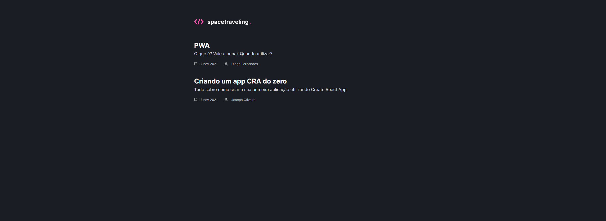

<h1 align="center">
  
</h1>

<h3 align="center">
  
</h3>

<p align="center">
  <a href="https://rocketseat.com.br">
    
  </a>
  <a href="https://www.linkedin.com/in/claudianopl/">
    
  </a>
</p>

<p align="center">
 <a href="#-sobre">Sobre</a> |
 <a href="#-layout">Layout</a> |
 <a href="#-requisitos">Requisitos</a> |
 <a href="#-tecnologias">Tecnologias</a> |
 <a href="#%EF%B8%8F-como-executar">Como executar</a> |
 <a href="#-licença">Licença</a> |
</p>

## 🚀 Sobre
<p align="left">
O spacetraveling foi desenvolvido com o intuito de ser um desafio de aprendizado do Ignite. O desafio consiste em ciar do zero uma aplicação de um blog integrado com o Prismic CMS a partir do Figma.
</p>

## 🎨 Layout
<p align="center">
  
</p>

## 📚 Requisitos
- Ter [**Git**](https://git-scm.com/) para clonar o projeto.
- Ter [**NodeJS**](https://nodejs.org/en/) para rodar o projeto em NextJS
- Ter [**Yarn**](https://classic.yarnpkg.com/en/) para instalar as dependências

## 🚀 Tecnologias
- [ReactJS](https://github.com/facebook/react)
- [NextJS](https://nextjs.org/)
- [TypeScript](https://github.com/microsoft/TypeScript)
- [Sass](https://sass-lang.com/)
- [Prismic](https://prismic.io/)
- [React Icons](https://react-icons.github.io/react-icons/)
- [date-fns](https://date-fns.org/)


## ⚙️ Como executar
💡 Como o back-end está em serverless não é necessário executar nenhuma configuração separada para ele.
</br></br>
⚠️ <strong>OBS:</strong> Quando clonar a aplicação não se esqueça de:
- Criar um arquivo .env com os seguintes dados:
  - Prismic CMS
    - PRISMIC_ENDPOINT
    - PRISMIC_ACCESS_TOKEN

```bash

    # Clonar o repositório
    $ git clone https://github.com/claudianopl/spacetraveling.git

    # Navegar para o diretório
    $ cd spacetraveling

    # Instalar as package
    $ yarn

    # Execute a aplicação em modo de desenvolvimento
    $ yarn dev

    # Se quiser ver as WebHooks do stripe execute em um terminal separado
    $ stripe listen --forward-to localhost:3000/api/webhooks

    # A aplicação será aberta na porta:3000 - acesse http://localhost:3000

```

## 📝 Licença
Esse projeto está sob a licença MIT. Veja o arquivo [LICENSE](LICENSE.md) para mais detalhes.

---

<p align="left">
Feito com 💜 by Claudiano Lima
<p>

<p align="right">
  
  &nbsp;&nbsp;&nbsp;&nbsp;&nbsp;&nbsp;
  
</p>
